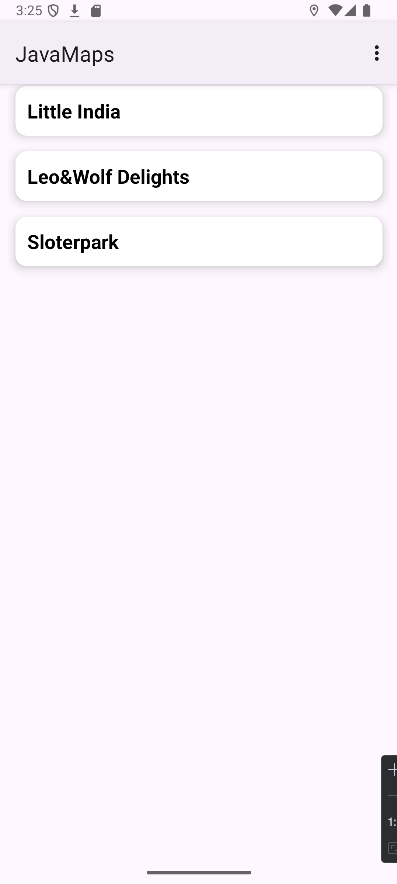
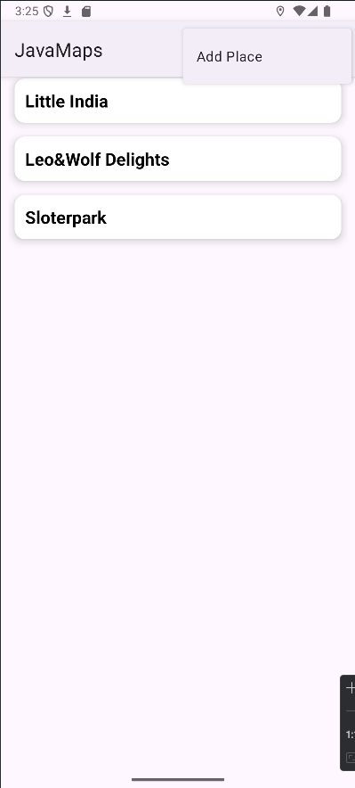
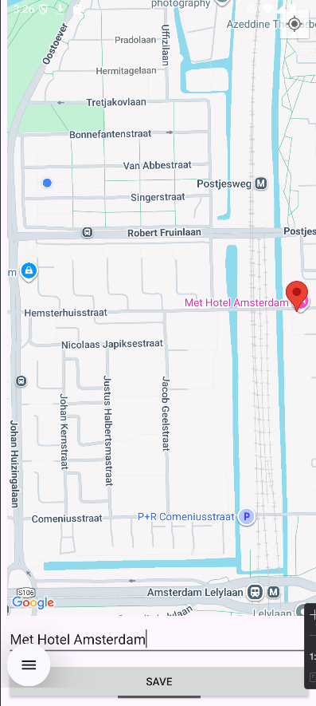
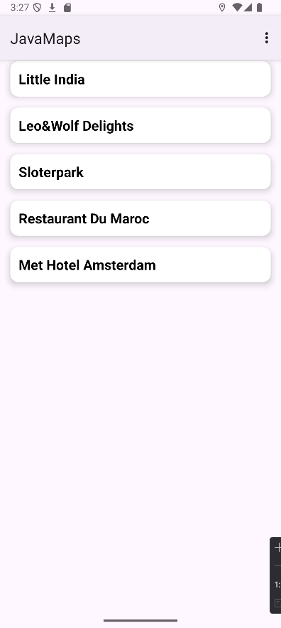
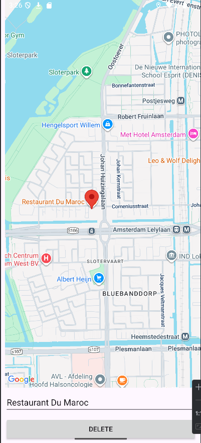

# 🗺️ Java Maps App

## 📌 Proje Hakkında
Bu proje, **Google Maps** entegrasyonu ile kullanıcıların konum kaydedebileceği, kaydedilen konumları **Room Database** içinde saklayabileceği ve sonrasında bu konumları **RecyclerView** aracılığıyla görüntüleyip silebileceği bir Android uygulamasıdır.  

Uygulamada:
- Harita üzerinde uzun basarak konum seçme  
- Seçilen konuma isim verme ve kaydetme  
- Kaydedilen konumları listeleme  
- Listedeki konumlara tıklayarak detayını görüntüleme  
- İstenilen konumu silme  

özellikleri bulunmaktadır.

---

## 🛠️ Kullanılan Teknolojiler
- **Java**
- **Google Maps API**
- **Room Database**
- **RxJava3**
- **RecyclerView**
- **ViewBinding**
- **SharedPreferences**

---

## 📷 Ekran Görüntüleri

 

---

## 🎯 Özellikler

📍 Haritada konum seçme

📝 İsim vererek kaydetme

📋 RecyclerView ile listeleme

🔎 Tıklayınca detayını görme

❌ Konumu silme
